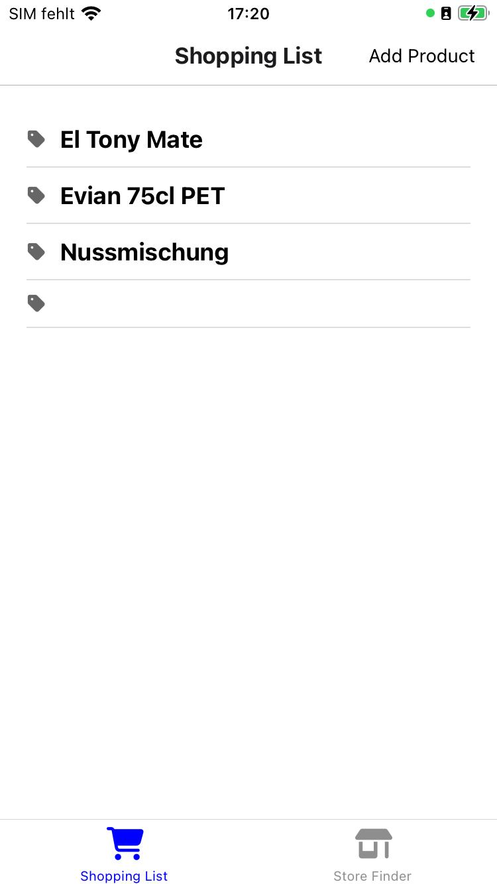
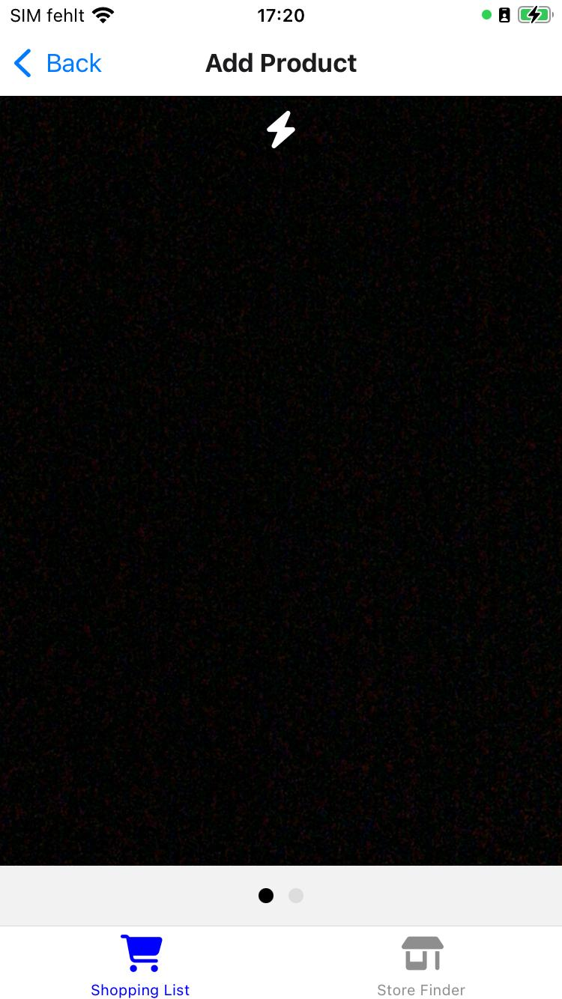
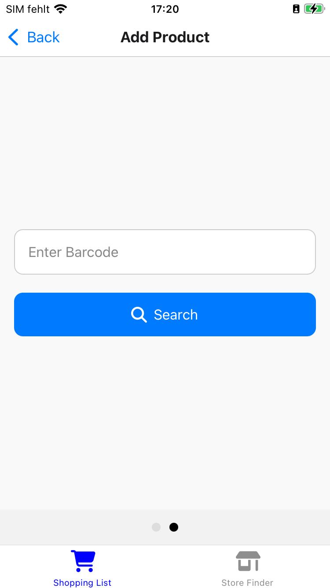
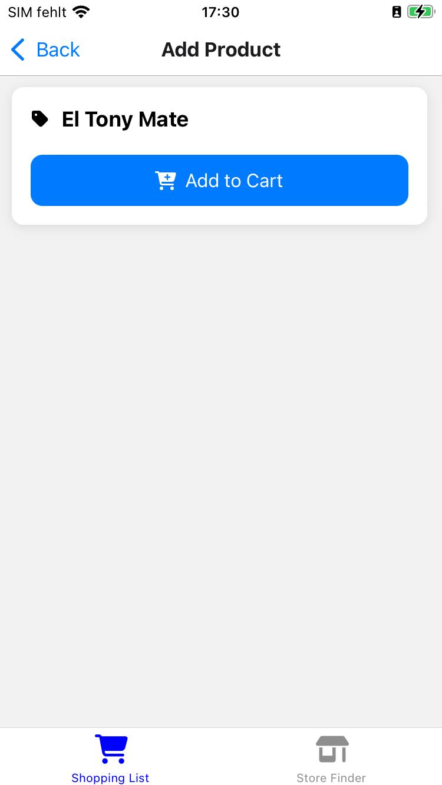

# Shopping Liste Dokumentation

Diese Shopping Liste wurde mit React Native und TypeScript entwickelt und besteht aus mehreren Hauptkomponenten:

## Hauptkomponenten

### 1. Shopping List

- **Beschreibung**: Man sieht die eigene Shopping Liste mit allen Produkten

- **Funktionalitäten**: -

### 2. Add Item

#### 2.1 Barcode Scanner

- **Beschreibung**: Mithilfe der Kamera kann man ein Barcode scannen und ein Produkt suchen.

- **Funktionalitäten**:
    - Barcode scannen
    - Blitz ein/ausschalten
    - Produkt suchen

#### 2.2 Manuelle Eingabe

- **Beschreibung**: Manuelles eingeben von Barcode zum suchen des Produktes.

- **Funktionalitäten**:
- Barcode eingeben
- Produkt suchen

#### 2.3 Produkt hinzufügen

- **Beschreibung**: Das gesuchte Produkt wird angezeigt und man kann es der Einkaufsliste hinzufügen

- **Funktionalitäten**: hinzufügen der Einkaufsliste

### 3. Store Finder

- **Beschreibung**: Nicht Implementiert

- **Funktionalitäten**: -

## Technologien

Hier wurde die KameraView von `react-native-camera` benutzt, um den Barcode Scanner zu implementieren. Die App wurde
mit `React Native` und `TypeScript` entwickelt. Die Daten werden mit `AsyncStorage` gespeichert. Als Navigation
wurde `React Navigation` benutzt in kombination mit `Stack Navigation`. Als API wurde die `Open API`
von `Open Food Facts` benutzt.

## Figma-Design

- **Wireframe**: https://www.figma.com/design/Tw8JdmdUL6AhKmUBs5oes5/Untitled?node-id=1-1739&t=6PC0uCE4IdhkeQyG-1

- **Appstore Page Template**: -
 